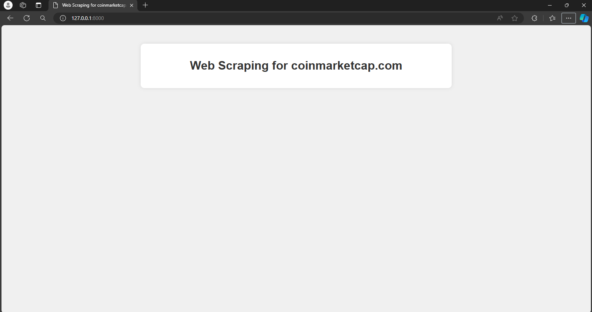
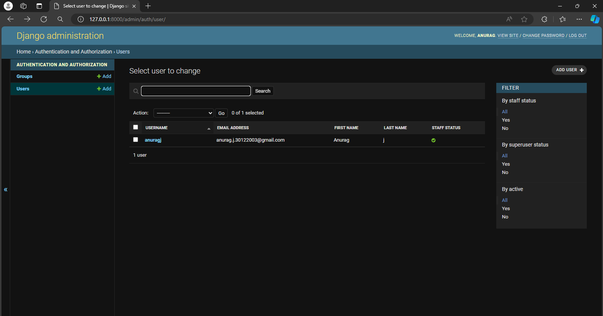
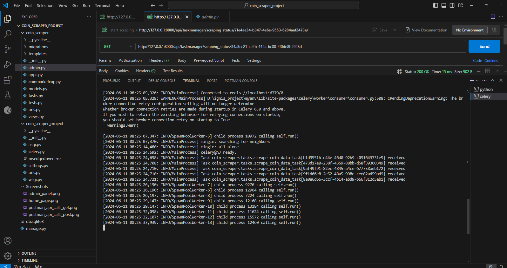
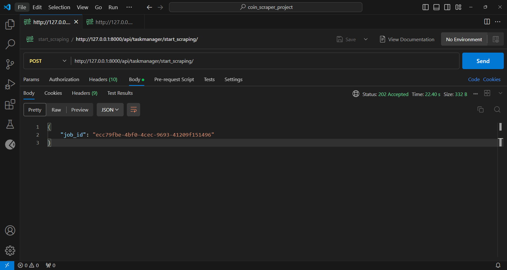
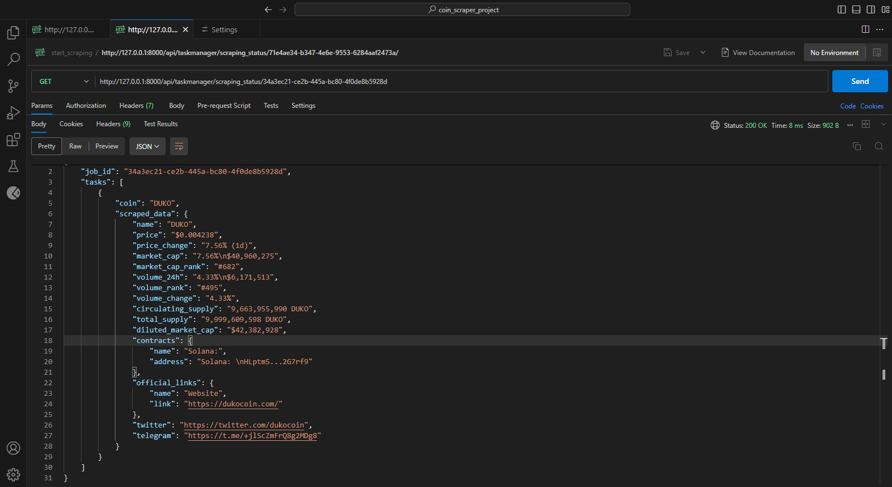

# django-admin-api-project

This Django REST Framework project provides an API for retrieving cryptocurrency data from CoinMarketCap. The API accepts a list of cryptocurrency acronyms, scrapes the data from the website, and returns a JSON response containing the relevant information.

<h2>Features</h2>
<ul>
  <li>Django REST Framework: Built using Django and Django REST Framework for creating APIs.</li>
  <li>Celery: Asynchronous task queue for handling background tasks.</li>
  <li>Requests: HTTP library for making requests to the CoinMarketCap website.</li>
  <li>Selenium: Web scraping library for navigating and extracting data from dynamic web pages.</li>
  <li>CoinMarketCap Website: Data scraped from CoinMarketCap, a popular platform for cryptocurrency market data.</li>
</ul>

<h2>Prerequisites</h2>
<ul>
  <li>Python Environment</li>
 <li>Django</li>
 <li>Django REST Framework</li>
 <li>Celery</li>
 <li>Requests</li>
 <li>Selenium</li>
 <li>Web Browser Driver</li>
 <li>Code editor (Vscode)</li>
</ul>

<h2>✨Let’s Start the Installation ✨</h2>

step  : Install 
```bash
pip install django djangorestframework celery requests selenium
```


<h2>Running the application at the end url</h2>

```bash
/api/taskmanager/start_scraping
/api/taskmanager/scraping_status/<job_id>

```

<h2>Output</h2>

*Home Page*


*Admin Panel*


*Celery Connect Page*


*Postman API Calls - POST Request*


*Postman API Calls - GET Request*


<h2>Sample Output Table</h2>

| Coin | Name | Price | Price Change | Market Cap | Market Cap Rank | Volume 24h | Volume Rank | Volume Change | Circulating Supply | Total Supply | Diluted Market Cap | Contract Name | Contract Address | Official Links | Twitter | Telegram |
| ---- | ---- | ----- | ------------ | ---------- | --------------- | ---------- | ----------- | ------------- | ----------------- | ------------ | ------------------ | ------------- | ---------------- | -------------- | ------- | -------- |
| DUKO | DUKO | $0.00422 | 7.89% (1d) | $40,784,677 | #684 | $6,175,533 | #500 | 4.12% | 9,663,955,990 DUKO | 9,999,609,598 DUKO | $42,201,232 | Solana | Solana: HLptm5...2G7rf9 | [Website](https://dukocoin.com/) | [Twitter](https://twitter.com/dukocoin) | [Telegram](https://t.me/+jlScZmFrQ8g2MDg8) |


